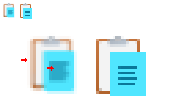
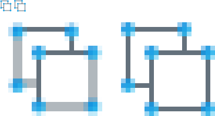
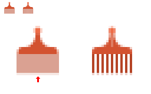
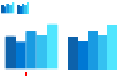
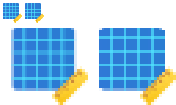
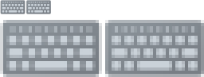

# 🚧 SVG Pixel Snapping (Grid Fitting) 🚧
Dwayne Robinson 2026-10-01

# 🛑 *This is preliminary with no working implementation yet*

# Why – The Problem

SVG is great for resolution independent iconography, but try rendering icons to sizes they weren't designed for, and notice...

- The blurry borders and collapsed lines of text on the page:

  

- The asymmetric connectors with a mix of crisp lines and muddy gray lines:

  

- Collapsed comb tines when the SVG canvas is displayed shifted, even at the natural canvas pixel size:

  

- Faint gaps between bars in the bar chart:

  

- Uneven gridlines:

  

- Shifted key caps:

  

- **TODO**: Insert more images showing problems. Include: blurry lines, excess detail which becomes a blurry mess, detail collapse, minimum pixel distance, contour offset.
- **TODO**: Add Pencil for 45 degree angle – LunaSvgTestData\icons8.com\icons8-office-edit XS 16x16.svg
- **TODO**: Dotted gridlines that collapse at 24px – LunaSvgTestData\icons8.com\icons8-fluency-select-all.svg

# What

This document extends SVG with microadjustment attributes to snap to pixels and remedy those fuzzy edges/smudgy details when the graphic is rendered at sizes it wasn't an intended multiple of, especially for small size scenarios (e.g. iconography in toolbars, menus, webpage links) on medium-DPI displays (e.g. 24x24px, 32x32px, 48x48px). Although monitor resolutions *have* increased over the decades, notably with phone screens, the PPI for desktop monitors still yields visible artifacts, and the most common monitor resolution in 2026 is only 1920x1080.

## Nonsolutions already tried

- [shape-rendering](https://developer.mozilla.org/en-US/docs/Web/SVG/Reference/Attribute/shape-rendering) with `crispEdges` gives you jagged geometry, whereas you still want smoothly rendered circles and lines, just with their bounds aligned to the pixel grid.
- Designing your SVG files on a grid works well when displayed at *that size*, but designing for multiple target sizes (24x24, 32x32...) becomes cumbersome and completely defeats the benefit of *scalable* vector graphics.
- TrueType glyphs offer an alternative to SVG with powerful grid fitting capabilities, but they have many caveats: hinting is very challenging to graphic designers given the low-level bytecode instruction set, integration into the workflow is more awkward than just adding some lose SVG files (you need append glyphs to the file, assign a numeric id, and reference that opaque number to draw it), and it only supports monochrome color unless the rasterizer supports the latest COLR table with multiple layers and gradients. Additionally, OpenType supports SVG glyphs (not just TrueType glyphs), but there is no equivalent grid fitting support for SVG outlines.

## Design Plan

- ⏳1️⃣ Vet design by implementing it in:
    - ⏳1️⃣ [LunaSVG](https://github.com/sammycage/lunasvg)
    - ⏳2️⃣ Javascript polyfill library so webpages can dynamically fit an SVG to the current resolution (because I'm probably not going to update Chromium and deal with gn and ninja again :b).
    - ⏳3️⃣ [Adobe SVG Native](https://github.com/adobe/svg-native-viewer)
- ⏳1️⃣ Visualize grid-fitting in [LunaSvgSampleTest](https://github.com/fdwr/LunaSvgSampleTest).
- ⏳2️⃣ Create a Node CLI app to automatically apply grid-fitting attributes, which won't be perfect but could apply reasonable defaults.
- ⏳4️⃣ Inkscape support would be nice, to see anchors and edit adjustment properties and see adjustment lists in paths, but so long as priorities 1 and 2 are completed, and so long as Inkscape at least *preserves* the attributes, then I'm happy.

## Requirements

It should enable:

- Crisp horizontal and vertical edges, and alignment for diagonal edges
- Pixel rounded stroke widths
- Consistent stem thickness of paths
- Shape symmetry around centers
- Equal shape spacing and gaps
- Alignment between separate shapes that are part of a large object
- Selective removal of small details at smaller pixels per unit.
- Constraints like minimal gaps between items so they don't collapse/abut and appear merged
- Simple implementations (not a TrueType-level stack-based instruction executor)
- Simple authoring experience with no programming experience needed
- Tooling to produce a "not terrible" default fitting, even without author intervention

## Nongoals

It doesn't ensure:

- Pixel alignment under arbitrary transforms
- Identical pixel results under different rasterizers
- Preserved geometry and aspect ratio after grid fitting

## At a glance

Grid fitting attributes reside in the `grid:` namespace (or maybe `ps:` for pixel snapping, or `gf:` for grid fitting 🤷‍♂️). Here's a simple octagon with every path vertex rounded:

```xml
<svg
    xmlns="http://www.w3.org/2000/svg"
    xmlns:grid="https://github.com/fdwr/SvgGridFitting"
    viewBox="0 0 40 40"
    width="36px"
    height="36px"
    >
    <!-- Simplest case - Round all points in the shape to the nearest pixel corner. -->
    <polygon
      fill="red"
      stroke="none"
      points="12,1 28,1 39,12 39,28 28,39 12,39 1,28, 1,12"
      grid:adjust="round()"
    />
    <!-- Round the path such that the stroke is well aligned (about 2.7 pixels wide). -->
    <polygon
      fill="none"
      stroke="white"
      stroke-width="3"
      points="16,9 24,9 31,16 31,24 24,31 16,31 9,24, 9,16"
      grid:adjust="roundStroke()"
    />
</svg>
```

Adjustments apply to all points within a shape, and `adjust` can take a *sequence* of microadjustment operations (like `transform`):

```xml
<svg xmlns:grid="https://github.com/fdwr/SvgGridFitting" viewBox="0 0 48 48" width="40px" height="40px">
    <!-- Round the four points of a rectangle upward (ceil for y) and leftward (floor of x). -->
    <rect x="6" y="6" width="28" height="28" fill="blue" grid:adjust="floor(x) ceil(y)"/>

    <!--
        Use a free anchor to round the rectangle's bottom-left to the nearest whole pixel corner
        while leaving the size alone and right edge potentially fuzzy.
    -->
    <grid:anchor id="bottom-left-anchor" x="10" y="38" grid:adjust="round()" />
    <rect x="16" y="16" width="28" height="28" fill="red" grid:adjust="attach(#bottom-left-anchor)" />

    <!--
        Use an inner anchor to round the bottom-left corner to the nearest pixel horizontally and
        down vertically
    -->
    <rect x="16" y="16" width="18" height="18" fill="green" grid:adjust="attach(#inner-anchor)">
        <grid:anchor id="inner-anchor" x="left" y="bottom" grid:adjust="nearest(x) ceil(y)"/>
    </rect>

    <!--
        Recenter an entire shape using the default fill bounds on either a pixel center or pixel
        corner depending on the size. This is essentially a microtranslation of the entire path,
        and it does not deform the shape.
    -->
    <circle cx="30" cy="30" r="10" fill="yellow" grid:adjust="recenterShape()" />

    <!--
        Recontour the path so the 2-unit wide stem is properly aligned on either pixel center or
        pixel corner and thickened to a whole pixel
    -->
    <path
        d="M0,16 L12,16 L12,28 Z
           M4,18 L10,23 L10,18 Z"
        fill="orange"
        grid:adjust="recontour(2)"
    />
</svg>
```

More complex path cases may need to apply different adjustments to different *components*, where splitting up the path is not feasible, and so `path` supports supports a *list* of semicolon-delimited adjustments:

```xml
<svg id="ShoppingCart" viewBox="0 0 256 256" width="32" height="32" xmlns:grid="https://github.com/fdwr/SvgGridFitting">
    <grid:anchor id="cartBottom" x="80" y="180" />

    <!-- Ensure at least 1 pixel of separation between the wheel and cart -->
    <grid:anchor id="wheelsTop" x="80" y="196" grid:adjust="separate(#cartBottom 1)" />

    <!--
        Notice the g0 and g1 directives inside the grid:d path data that state which grid adjustment 0 to N-1 to use from
        the adjustments list. Sadly we can't insert the grid adjustment indices into the standard "d" attribute, or
        the renderers choke (typically failing the whole path, or the reading the string up to that point).
        So a duplicate "grid:d" is added, and any grid-aware tooling should produce the backwards-compatible
        "d" attribute by stripping out the "g#" instructions. If older tooling updates the path, the custom
        attribute would become desynchronized, or more likely lost.
    -->
    <path
        d="M100,216a20,20,0,1,1-20-20A19.9999,19.9999,0,0,1,100,216Zm84-20a20,20,0,1,0,20,20A19.9999,19.9999,0,0,0,184,196ZM233.252,75.29639
        l-24.1123,84.3955A28.12,28.12,0,0,1,182.2168,180H81.7832a28.12029,28.12029,0,0,1-26.92285-20.30713L30.81445,75.53271c-.04687-.15234-.09082-.30517-.13183-.46044L21.80566,44H12a12,12,0,0,1,0-24H24.82227A20.08558,20.08558,0,0,1,44.05273,34.50537L51.33691,60h170.377A11.99959,11.99959,0,0,1,233.252,75.29639ZM205.80566,84H58.19434l19.74218,69.09863A4.01838,4.01838,0,0,0,81.7832,156H182.2168a4.01824,4.01824,0,0,0,3.84668-2.90186Z"

        grid:d="g0 M100,216a20,20,0,1,1-20-20A19.9999,19.9999,0,0,1,100,216Zm84-20a20,20,0,1,0,20,20A19.9999,19.9999,0,0,0,184,196ZM233.252,75.29639
        g1 l-24.1123,84.3955A28.12,28.12,0,0,1,182.2168,180H81.7832a28.12029,28.12029,0,0,1-26.92285-20.30713L30.81445,75.53271c-.04687-.15234-.09082-.30517-.13183-.46044L21.80566,44H12a12,12,0,0,1,0-24H24.82227A20.08558,20.08558,0,0,1,44.05273,34.50537L51.33691,60h170.377A11.99959,11.99959,0,0,1,233.252,75.29639ZM205.80566,84H58.19434l19.74218,69.09863A4.01838,4.01838,0,0,0,81.7832,156H182.2168a4.01824,4.01824,0,0,0,3.84668-2.90186Z"

        grid:adjustments="recontour(24); recontour(40) attach(#wheelsTop)"
    />
</svg>
```

# How

1. Declaring **anchor** points that can be shared and referenced in microadjustments
2. Applying micro**adjust**ments:
    1. **Round**ing point coordinates to pixels (e.g. rounding to nearest, floor, ceil, pixel corners, pixel centers, half pixels...)
    2. **Align**ing shape coordinates to rounded anchors
    3. Appyling microtransforms to **nudge** and **stretch** points
    4. Displacing **contour**s (e.g. thickening a path edge to whole pixels and centering it)
    5. Applying geometric constraints to **separate** components (e.g. separating two lines at least 1 pixel apart)
3. **Switch**ing shape visibility based on pixel density (e.g. selectively hiding complex geometry at low pixel resolutions)

## Elements

### `<grid:anchor/>`

An invisible point to help anchor other shapes' points to and construct microtransforms to adjust them. They have no fill, stroke, or visibility (except in SVG editors). Anchor coordinates can be individually rounded and shared by multiple geometries for tiny translations and scaling. Anchors are typically defined soon before the shape that uses their `id` in an adjustment attribute. An unspecified x or y defaults to 0. Anchors do not extend any bounding box or clipping path retrieved by [`getBBox`](https://developer.mozilla.org/en-US/docs/Web/API/SVGGraphicsElement/getBBox), [`getBoundingClientRect`](https://developer.mozilla.org/en-US/docs/Web/API/Element/getBoundingClientRect), or [`getClientRects`](https://developer.mozilla.org/en-US/docs/Web/API/Element/getClientRects). Anchors need not be on or even near any contour. Indeed, for rounded rectangles, the off-contour 4-corner points beyond the curve are desired. Anchor adjustments can apply to multiple objects, including ones that are far away. For example a keyboard full of keys might have only one anchor to snap a keycap to whole pixels, but then every other keycap could reuse that same anchor's displacement. Pointer or keyboard events do not apply.

- `x`=0 – x coordinate in user coordinates, or the keywords `left`/`right`/`center` to refer to the parent's fill box (parent, since the anchor doesn't have one), when used as a child of a `SVGGeometryElement` (`rect`/`circle`/`path`...) or `g` or `svg` element. Percentages and other units behave similarly to any other shape coordinate.
- `y`=0 – y coordinate in user coordinates, or the keywords `top`/`bottom`/`center` to refer to the parent's fill box.
- `adjust` – series of microadjustments. See `grid:attribute` description for details.

```xml
<!-- Round the anchor to the nearest pixel corner -->
<grid:anchor id="someShapeCenter" x="30" y="40" grid:adjust="round()" />

<!-- Round the anchor to the nearest pixel center -->
<grid:anchor id="differentShapeCenter" x="30" y="40" grid:adjust="round(0.5)" />

<!-- Ensure separation of at least 1 pixel of this anchor from another anchor -->
<grid:anchor id="wheelsTop" x="80" y="80" grid:adjust="separate(#cartBottom 1)" />

<!--
    Round the left anchor leftward and the right anchor rightward, interpolating the middle anchor by
    their displacements
-->
<grid:anchor id="leftAnchor"   x="100" y="150" grid:adjust="floor()" />
<grid:anchor id="rightAnchor"  x="140" y="150" grid:adjust="ceil()" />
<grid:anchor id="middleAnchor" x="120" y="150" grid:adjust="stretch(#anchor1 #anchor2)" />
```

**TODO**:
- If they do not affect the bounding boxes, what about querying the anchor object itself directly? Should that return an empty but placed box?

### `<grid:adjustment/>`

A reusable series of adjustments in the `<defs>` section, including rounding, anchor transforms (nudges), recontouring, and separation contraints, with each adjustment executed in order. Multiple adjustments can be separated by semicolons to form a list of adjustments, useful for `<path>` where each group of adjustments is referenced by index 0 to N-1.

```xml
<defs>
    <adjustment id="myAdjustment" grid:adjust="round(x) floor(y)" />
    <adjustment id="myAdjustmentList" grid:adjust="floor(); ceil(); recontour(2)"/>
    <adjustment id="concatenatedAdjustmentList" grid:adjust="#myAdjustment; #myAdjustmentList"/>
</defs>

<polygon grid:adjust="#myAdjustment" points="..." />
<path grid:adjust="roundStrokeWidth()" adjustments="#myAdjustmentList" d="..."/>
```

- `id` – name of the adjustment to reuse in an `adjust` attribute later.
- `adjust` – the adjustments list definition. This `adjust` attribute can refer to other adjustments (e.g. `adjust="alignShape(...) #someOtherAdjustment"`), but circular references are not allowed (further recursion stops) and implementations should limit expansion to prevent malicious memory allocation failures (e.g. restrict concatenated strings to 1KB).

**TODO**:
- Are semicolons appropriate separators? They have precedent in `svg.elements.animate.keyTimes` (e.g. `keyTimes="0; 0.25; 0.5; 0.75; 1"`) https://developer.mozilla.org/en-US/docs/Web/SVG/Attribute/keyTimes, and semicolons are also oddly used to separate attributes inside attributes (e.g. `svgView(viewBox(0,0,200,200);preserveAspectRatio(none))`) https://svgwg.org/svg-next/linking.html#SVGFragmentIdentifiersDefinitions.

### `<grid:transformation/>`

A reuseable transformation list in the `<defs>` section (essentially `SVGTransformList`), including the standard `scale`, `translate`, `rotate`, and `shear` operations, plus the new `origin` which is equivalent to `transform-origin` folded directly into the `transform`. Defined transforms may be used in any `transform` attribute, including those on normal geometry along with those in rounding and constraints. The `matrix` function now takes an abbreviated form with just the first two elements, useful for expressing a uniform scale+rotation using a single 2D vector, where  `matrix(scaleX shearXToY)` expands `matrix(scaleX shearXToY -shearXToY scaleX 0 0)` (e.g. rotating by 30 degrees yields [0.866025404 0.5] and expands to [0.866025404 0.5 -0.5 0.866025404 0 0]). **NAMING**: I'm using the noun form `transformation` rather than verb `transform` to avoid confusion with "transform", since it's not an action applied to the scene, but rather a reusable component useable later by a "transform" statement.

- `id` – name of the transformation to use later in a `transform` or `adjust` attribute.
- `transform` – the transformation list.

```xml
<defs>
    <grid:transformation id="myTransform" transform="scale(2) translate(100 300)" />
    <grid:transformation id="turn45Sqrt2" transform="matrix(1 1)" />
</defs>

<g transform="#myTransform">...</g>
<line grid:adjust="grid(#turn45Sqrt2) round()" x1="10" y1="10" x2="40" y2="40">
```

**TODO**:
- Is `origin()` that useful? Should I delete it? Why did I originally add it 4 years ago? Hmm...

## Attributes

### `grid:adjust="..."`

Applies a series of microadjustments to the coordinates of a shape or the entire shape. This is a screenspace cousin to the `transform` attribute, and unlike `fill` but like `transform`, children do not inherit the property *verbatim* (which would doubly compound the transform), but they may inherit *effects* of the parent's adjustments, such as alignment translations. If you want multiple children to use the same adjustments, either define an adjustment in the `<defs>` section so it's easy to refer to (`adjust="#someDef"`) or use `adjust="inherit"` which explicitly indicates it's safe to inherit the parent adjustment because it wouldn't compound any adverse effects (like a double alignment translation).

```xml
<!-- Floor all the 4 points (corners) of the rectangle -->
<rect ... grid:adjust="floor()"/>

<!-- Round the stroke width to a whole pixel and recenter the strokes -->
<rect ... stroke="blue" grid:adjust="roundStrokeWidth() roundStroke()"/>
```

### `grid:adjustments="...; ..."`

A list of semicolon-separated adjustments for `<path>` (no other element supports it). Note that path's `adjust` is executed first, shared by all path components. **TODO**: Does this make sense? Should `adjustments` be folded into `adjust`? Otherwise it's weird that `<adjustment>` defines both with `adjust`, and yet it matters for path (granted, the distinction is understandable if you want to execute some adjustments for the whole path first, a sort of `preadjust`). Are there case you want to shared adjustments to all points in the path, that couldn't be achieved by applying it to a containing `<g>`?

```xml
<!-- List 3 adjustments for various parts of the path "d"ata. -->
<path d="..." adjustments="floor(); ceil(); recontour(2)"/>
```

**NOTE**: Passing a semicolon-separated adjustment list to an `adjust` attribute expecting just a single adjustment sequence isn't treated as an error, but it will only execute the first one (before the semicolon).

### `grid:d`

An extended `<path>` data string like the normal path `d` attribute that also supports a new `g#` command to specify the **g**rid-fitting index into the adjustments list. e.g. `d="g0 M20,30..."`. The default adjustment index is 0 (as if an implicit `g0` was before the string). Each `g` affects the instruction points that *follow* it, but not the current pen position or necessarily the entire component, where `g0 M20,30 g1 L25,35` would apply `g0` to the 20,30 coordinate and `g1` to the 25,35 coordinate, but `g1` does *not* apply to the starting coordinate of the line even though it comes before the `L`.

Note that because path readers are not prepared for foreign path commands, and most choke upon encountering one (either rejecting the entire path, or rendering everything parsed up to that point), it's important to duplicate the standard "d" attribute for compatibility. This is annoying redundancy, but alas necessary because readers do not gracefully step over unknowns.

```xml
<path
    d="M100,216a20,20,0,1,1-20-20A19.9999,19.9999,0,0,1,100,216Zm84-20a20,20,0,1,0,20,20A19.9999,19.9999,0,0,0,184,196ZM233.252,75.29639
    l-24.1123,84.3955A28.12,28.12,0,0,1,182.2168,180H81.7832a28.12029,28.12029,0,0,1-26.92285-20.30713L30.81445,75.53271c-.04687-.15234-.09082-.30517-.13183-.46044L21.80566,44H12a12,12,0,0,1,0-24H24.82227A20.08558,20.08558,0,0,1,44.05273,34.50537L51.33691,60h170.377A11.99959,11.99959,0,0,1,233.252,75.29639ZM205.80566,84H58.19434l19.74218,69.09863A4.01838,4.01838,0,0,0,81.7832,156H182.2168a4.01824,4.01824,0,0,0,3.84668-2.90186Z"

    grid:d="g0 M100,216a20,20,0,1,1-20-20A19.9999,19.9999,0,0,1,100,216Zm84-20a20,20,0,1,0,20,20A19.9999,19.9999,0,0,0,184,196ZM233.252,75.29639
    g1 l-24.1123,84.3955A28.12,28.12,0,0,1,182.2168,180H81.7832a28.12029,28.12029,0,0,1-26.92285-20.30713L30.81445,75.53271c-.04687-.15234-.09082-.30517-.13183-.46044L21.80566,44H12a12,12,0,0,1,0-24H24.82227A20.08558,20.08558,0,0,1,44.05273,34.50537L51.33691,60h170.377A11.99959,11.99959,0,0,1,233.252,75.29639ZM205.80566,84H58.19434l19.74218,69.09863A4.01838,4.01838,0,0,0,81.7832,156H182.2168a4.01824,4.01824,0,0,0,3.84668-2.90186Z"

    grid:adjustments="recontour(24); recontour(40) attach(#wheelsTop)"
/>
```

### `grid:requiredPpv` / `grid:requiredPpu`

Conditionally selects the first shape inside a `<switch>` that matches the required pixels-per-view or pixels-per-unit range, useful for hiding details that would otherwise disappear and just add noise when at small resolutions, like omitting drop shadow, switching a perspective orientation to a flat one (e.g. Windows 7 Notepad in Alt+Tab vs top left system icon), or reducing the number of objects (like a pad with a pencial at large sizes but just the pad at smaller sizes).

Anything in the [`switch`](https://developer.mozilla.org/en-US/docs/Web/SVG/Reference/Element/switch) outside that inclusive range is hidden, just like with `requiredExtensions` and `systemLanguage`. Using pixels-per-view is natural for iconography when thinking in terms of the entire SVG canvas (e.g. 20x20, 32x32...). Using pixel-per-unit is less intuitive, but it's more robust if you change the canvas size later (which would mess up any switch ranges since the entire canvas size is now different), if you copy and paste a shape from one SVG to another that might have a different size, or if you change a shape's transform (which would invalidate assumptions about the whole). If only the first component is given, it's treated as a minimum lower bound.

```xml
<svg xmlns="http://www.w3.org/2000/svg" xmlns:grid="https://github.com/fdwr/SvgGridFitting" viewBox="0 0 32 32" width="32px" height="32px">
    <switch>
        <shapeA grid:requiredPpv="32" /><!-- icon is >=32, with room for detail -->
        <shapeB grid:requiredPpv="16 32" /><!-- icon is >=16 pixels, less detailed -->
        <shapeC/><!-- Fine details are too crowded to display, and so use simpler shape -->
    </switch>
</svg>
```

```xml
<svg xmlns="http://www.w3.org/2000/svg" xmlns:grid="https://github.com/fdwr/SvgGridFitting" viewBox="0 0 32 32" width="32px" height="32px">
    <switch>
        <shapeA grid:requiredPpu="1" /><!-- The icon is >= 1:1, meaning at least 1 pixel per user unit, with room for detail -->
        <shapeB grid:requiredPpu="0.5" /><!-- The icon has at last a half pixel per user unit, less detailed -->
        <shapeC/><!-- Fine details are too crowded to display, and so use simpler shape -->
    </switch>
</svg>
```

**NAMING**: pixelsPerUnit and pixelsPerView rather than ppuRange and ppvRange?

## Adjustment operators:

These occur inside an `adjust` attribute:

- `round`
    - `floor`
    - `ceil`
    - `nearest`
- `roundVertices`?
- `recenter`
- `roundStrokeWidth`
- `roundStroke`
- `nudge`
- `alignShape`
- `recontour`
- `grid`
- `separate`
- `stretch`

Each operator accepts a variable number of parameters like `transform`, but unlike `transform`, they are heterogeneous (not just a list of scalars) and support named parameters. e.g. (`recenter(2 ceil)` and `nudge(#someAnchor reorient=[1 1])`) since it can get unwieldly otherwise. Not all operators fully make sense in all contexts, like `roundStrokeWidth` or `recontour` inside an anchor's `adjust` property (since it's a single point with no strokeable content), but such cases are not degenerate errors, treating either with reasonal defaults (`recontour` would center the anchor point given it's default position rounding) or as a nop (`roundStrokeWidth` is ignorable).

### `round(axes, bias, spacing ...)`

round value/coordinate to nearest whole integer or multiple of `spacing`, defaulting with halves toward negative infinity (not round to nearest even, which would introduce a staggered appearance).

- `axes`=xy – which axes to round: `x`,`y`,`xy`. **TODO**: Consider that technically this is redundant with `reorient` (where a `[0 0 0 1]` matrix would constrain movement to y-only), but then this is much more concise, semantically clearer, and less error prone. So probably worth keeping. Additionally, keeping the `axes` fixes a problem with positional parameters where saying `floor(x, 0.5)` is clear enough that you're flooring x with a bias of 0.5, but saying `floor(0.5)` looks like you're flooring the input value 0.5, which is confusing.
- `bias`=0 – the value that determines the pixel/subpixel origin, typically useful for rounding to pixel corners (0) vs pixel centers (0.5). The bias is subtracted from the coordinate before rounding and then added back. e.g. floor(5.2 - 0) + 0 = 5.0, but floor(5.2 - 0.5) + 0.5 = 4.5. The expected is 0 through 0.9999, but it could be larger if the spacing is larger, like 1. 
- `spacing`=1 – how far apart the rounding is in grid units. e.g. Given the default grid of device pixels, spacing 2 means every 2 pixels, and 0.5 means every half pixel. The coordinate is divided by the spacing before rounding and then rescaled afterward. e.g. floor(5.2 / 2) * 2 = 4, and floor(7.8 / 2) * 2 = 6, and spacing=2 with bias=1 yielding floor((7.2 - 1.0) / 2.0) * 2.0 +  1.0 = 7.0.
- `prebias`=bias – value subtracted from the coordinate before rounding.
- `postbias`=bias – value added to the coordinate after rounding. **TODO**: Maybe delete prebias and postbias. They enable rounding halves N.5 up or down when used with ceil/floor, but it's probably easier to just have an explicit mode=nearestLow and mode=nearestHigh. It also enables weirdness like being able to translate by large amounts in screenspace, which isn't the intent of grid fitting - it's just intended to slightly nudge points by a pixel fraction or two.
- `mode`=nearestLow – which rounding mode. There is deliberately no round-halves-to-nearest-even, which would yield a staggered appearance graphically.
    - `floor` - round value/coordinate toward negative infinity.
    - `ceil` - round value/coordinate toward positive infinity.
    - `nearestLow` - round toward nearest integer with halves/ties low toward negative infinity.
    - `nearestHigh` - round toward nearest integer with halves/ties high toward positive infinity.
    - `nearest` - short alias of `nearestLow` (typically graphics rounds leftward).
- `reorient`=[1 0] – reorient the displacement vector of the coordinate, which is useful for shear and reversing the vector. The default is a unit vector pointing (x=1 y=0) which yields an identity matrix. e.g. [-1 0] reverses the displacement. [1 1] shears the displacement along 45 degrees. [-1 0 0 1] mirrors displacement horizontally. [2] scales the displacement 2x for x and y. **NAMING**: `matrix`? `displaceBy`? `displacementMatrix`? `projectAlong`? `along`?
- `preserveTangent`=false – constrain the displacement so it proportionally moves the point, useful at angled corners to preserve the edge tangents. Note it has no effect on 90-degree corners.
- `requireAlignedAxis`=true – disable rounding if rotation or shear apply to the world-to-screen matrix (only scaling+translation).
- `transformReinterprets`=true – mirrored or rotated transformations reinterpret the rounding mode (e.g. horizontally mirroring flips ceil to floor, and rotation swaps x and y).
- `directionInverts`=false – a negative edge direction (e.g. a line pointing downward or leftward) inverts the rounding mode, useful for "inward" and "outward" rounding. e.g. For a rectangle with 4 corner points and `ceil` rounding mode, the bottom right corner
- `windingInverts`=false – whether winding direction inverts the interpretation of rounding directions (floor <-> ceil).
- ?`fraction`=1 – a fraction to multiply the displacement by, rather than a full 100%. **TODO**: This seems completely redundant now with reorient, where you could just say `reorient=0.5`.

```xml
<!-- Round all the 4 points (corners) of the rectangle -->
<rect ... grid:adjust="round()"/>

<!-- Round to every pixel center using half bias -->
<rect ... grid:adjust="round(xy 0.5)"/>

<!-- Floor to every half pixel -->
<rect ... grid:adjust="round(xy, 0, 0.5, mode=floor)"/>

<!-- Round up to every two pixels (even) only along x -->
<rect ... grid:adjust="round(x spacing=2 mode=ceil)"/>

<!-- Round up to every two pixels (odd) only along y -->
<rect ... grid:adjust="round(y 1 2 mode=ceil)"/>

<!-- Round along x, and displace along y at a 45-degree corner to preserve the angle -->
<rect ... grid:adjust="round(x reorient=[1 1])"/>
```

**TOOD**:
- Should any attributes related to edges/normals/winding be factored out into a separate operator, leaving round to be pure point rounding?
- There are many common cases for rounding that could be expressed as a single keyword, like: upward, downward, leftward, rightward (achieved via floor/ceil and rounding only one axis), or inward, outward (achieved via floor/ceil and flipping based on a point's edge directions). Should these be added as keywords, should I include some common definitions here for the `<defs>` section to define?

```xml
<defs>
    <adjustment id="roundUpward"    adjust="round(y mode=floor)">
    <adjustment id="roundDownward"  adjust="round(y mode=ceil )">
    <adjustment id="roundLeftward"  adjust="round(x mode=floor)">
    <adjustment id="roundRightward" adjust="round(x mode=ceil )">
    ...
    <!-- I'm not sure about these ... -->
    <adjustment id="roundInward"    adjust="round(x mode=floor directionInverts=true)">
    <adjustment id="roundOutward"   adjust="round(x mode=ceil  directionInverts=true)">
</defs>
```

### `floor(... mode=floor ...)`

Convenience function to round value/coordinate toward negative infinity.

- Inherit all parameters from `round`.

```xml
<grid:anchor id="someAnchor" x="42" y="7" grid:adjust="floor()"/>
```

### `ceil(... mode=ceil ...)`

Convenience function to round value/coordinate toward positive infinity.

- Inherit all parameters from `round`.

```xml
<grid:anchor id="someAnchor" x="42" y="7" grid:adjust="ceil()"/>
```

### `nearest(... mode=nearestLow ...)`

Convenience function to round value/coordinate toward nearest integer, with halves rounded toward negative infinity (ties rounded low).

```xml
<grid:anchor id="someAnchor" x="42" y="7" grid:adjust="nearest()"/>
```

- Inherit all parameters from `round`.

### `roundVertices()` ?

Maybe pull the more advanced aspects out of `round` related to normals and edges, so that rounding can be pure (then applicable to 1D scalars and sensible outside shapes too).

### `recenter(size, sizeRoundingMode)`

Round to either pixel centers or pixel corners depending on whether the input size is odd or even (after scaled to screen space and rounded). This lower level function is sometimes useful, but most use cases can generally favor `alignShape()` or `roundStrokeWidth()`+`roundStroke()` or `recontour`.

- `size` – an input size in user coordinates (typically the size of a shape or stem thickness) to transform to screen space, round to an integer, and evaluate the parity to determine the position rounding bias of 0 for even sizes or 0.5 for odd sizes. If a single scalar size is given, it's treated as `[width=size height=size]`.
- `sizeRoundingMode`=nearestLow – rounding mode for the input size.  Note it's only relevant for `positionRounding=center*`.
- `sizeBias` – a bias to add to the screen-space size before rounding, which can be used to change the rounding threshold or invert even/odd parity.
- `positionRoundingMode`=nearestLow – rounding mode for the position. **TODO**: Maybe unnecessary, since you'd always want recenter to, well, center it - just putting here now for completeness. Maybe you want nearestHigh.
- `positionBias`=0 – extra rounding bias for the position. **TODO**: Maybe unnecessary since determined by the scaled size's parity - just putting here now for completeness.

```xml
<!--
    Recenter each point in the path based on the given stroke thickness.
    Note roundStrokeWidth() then roundStroke() are probably more robust/flexible since recenter()
    doesn't round the stroke width (only repositions), and the stroke width value needs to be
    repeated as a parameter. Alternately recontour() may be better if you need to consider angle
    or arc preservation or winding direction.
-->
<path fill="none" stroke-width="2" stroke="blue" grid:adjust="recenter(2)" d="..." />

<!--
    Recenter the free anchor to the given size and attach to both grouped circles.
    Alternately you could use just alignShape() here on the "g" instead,
    or you could repeat recenter(40) on both of the circles independently, since they
    would yield the same displacement, but it's conceptually cleaner to move both together.
    Though, using recenter(20) on the white circle would be wrong, as its diameter could
    given inconsistent displacement from the containing red circle.
-->
<anchor id="circleCenter" x="50" y="50" grid:adjust="recenter(40)"/>
<g grid:adjust="attach(#circleCenter)">
    <circle cx="50" cy="50" r="20" fill="red" />
    <circle cx="50" cy="50" r="10" fill="white" />
</g>

<!-- Recenter the rectangle and ellipse. Here again alignShape() is recommended instead. -->
<rect x="50" y="50" width="40" height="20" grid:adjust="recenter([40 20] sizeRounding=ceil)"/>
<ellipse cx="100" cy="100" rx="20" ry="30" grid:adjust="recenter([60 40] ceil)"/>

<!--
    Here's a case where recenter() is uniquely useful, since alignshape() would use the fill bounds
    of the entire shape which is asymmetric here, thus getting the wrong placement.
-->
<g grid:adjust="attach(#circleCenter)">
    <anchor id="circleCenter" x="50" y="50" grid:adjust="recenter(40)"/>
    <circle cx="50" cy="50" r="20" fill="red" />
    <circle cx="60" cy="50" r="15" fill="white" />
</g>
```

**NAMING**:
- `recenter` seems good, given recentering a shape is exactly the intended use case for this operation (describes higher-level intent more than the low-level operation). Previously I called it `roundParity`, which made sense logically (you're checking whether something is even or odd and rounding with a bias accordingly), but it didn't semantically capture the *intent*, which is to *center* things.

**TODO**:
- Centering *whole* shapes is typically more useful than centering individual points within a path (that's also useful, but it's best combined with recontouring anyway to adjust the stem thicknesses). So an explicit `recenterShape` would be useful that centers the midpoint of the shape fillbox and translates the whole shape. For distinction, maybe renamed `recenter` to `recenterPoints` when adjusting individual points.

### `roundStrokeWidth(bias, spacing)`

Round the current stroke width in screen-space to whole pixels, rounding it to nearest-low by default. The `roundStrokeWidth()` call should come before any functions that use the stroke width in their computations, like `roundStroke()`. There should only be one `roundStrokeWidth()` in an adjustment sequence, since implementations do not support differing stroke widths within a single geometric shape. The last one present wins.

- `bias`=0 – the value that determines the rounding origin, typically useful for rounding to whole pixels (N.0) vs pixel-and-a-half sizes (N.5). The bias is subtracted from the coordinate before rounding and then added back. e.g. floor(5.2 - 0) + 0 = 5.0, but floor(5.2 - 0.5) + 0.5 = 4.5. The expected is 0 through 0.9999, but it could be larger if the spacing is larger, like 1. 
- `spacing`=1 – how far apart the rounding is. e.g. 2 is every 2 pixels. 0.5 is every half pixel. The coordinate is divided by the spacing before rounding and then rescaled. e.g. floor(5.2 / 2) * 2 = 4, and floor(7.8 / 2) * 2 = 6, and spacing=2 with bias=1 yielding floor((7.2 - 1.0) / 2.0) * 2.0 +  1.0 = 7.0.
- `mode`=nearestLow – which rounding mode: floor, ceil, nearestLow, nearestHigh, nearest=nearestLow. See `round` for `mode` details.
- `prebias`=bias – value subtracted from the coordinate before rounding. Prebias could be useful for `roundStrokeWidth` to bump up small sizes.
- `postbias`=bias – value added to the coordinate after rounding.
- `minimum`=1 – minimum pixel width for the stroke. If the stroke width is 0 (a legal value which essentially means no stroke), this is ignored. **TODO**: For zero stroke width, it makes no sense for this minimum to be enforced, but should the equation be `iif(originalStrokeWidth > 0, min(roundedStroke, minimumValue), 0)` or something more complex?

**TODO**:
- Does `roundStrokeWidth` have any meaningful effect inside an `<anchor>`? Maybe it does when used in conjunction with `alignShape(stroke ...)`.

```xml
<circle cx="50" cy="50" r="20" fill="none" stroke-width="3" stroke="blue" grid:adjust="roundStrokeWidth()"/>

<!-- Round the screen-space stroke to odd sizes only, 1,3,5... -->
<circle cx="50" cy="50" r="20" fill="none" stroke-width="3" stroke="blue" grid:adjust="roundStrokeWidth(0.5 2)"/>
```

**NOTES**:
- It's generally desireable to call `roundStrokeWidth` and `roundStroke` in sequence, but I could see cases where you *only* want to round the position of the stroke (leaving the width as-is) and maybe cases where you want to round the stroke thickness but leave the position unchanged (though the latter seems less likely).

### `roundStroke()`

Round coordinate based on the current stroke-width so that even thicknesses are aligned to pixel corners and odd thicknesses are aligned to pixel centers. e.g. `roundStroke(floor [left top])` to align the top left, `roundStroke()` to center, `roundStroke(floor [left top] directionInverts=true)` for rounding outward.

- `mode`=center – rounding mode: floor, ceil, nearestLow, nearestHigh, nearest=nearestLow, centerLow, centerHigh, center=centerLow.
- `offset`=[center center] – the rounding point for the stroke, using normalized values 0-1 or keywords `[left/center/right top/center/bottom]`. e.g. `anchor=[left top]` or `anchor=[1 0]` for the top-right or `offset=[0.5 0.5]` for the midpoint.
**NAMING**: alignment? basePoint? referenceOrigin? origin? referencePoint? hotSpot? localOffset? normalizedOffset?
- `directionInverts` – invert the rounding mode if the edge flows negative. **TODO**: Does this need to be an x,y pair, like `directionInverts=[false true]` if you want asymmetric behavior across axes? **TODO**: Do I need to consider winding direction too here? Is `directionInverts` sufficient?

```xml
<circle cx="50" cy="50" r="20" stroke-width="3" grid:adjust="roundStrokeWidth() roundStroke()"/>
```

### `nudge(#anchor)`

Displace coordinates with a small translation from an anchor's rounding displacement.

- `#anchorName` – name of the anchor to fetch the displacement from.
- `reorient`=[1 0] – reorient the displacement vector of the coordinate by the matrix. See above.

**NAMING**:
- Use `translate`? e.g. `translate(#anchorName)` `translate(#anchorName1ForX #anchorName2ForY)`. I could, but it would confusingly differs from transform's `translate` by taking different parameters; it's less clear that it's translating by the tiny *displacement* of the anchor rather than say the x,y coordinate of the anchor; and `translate` can shift objects by huge amounts, whereas `nudge` is semantically more descriptive (a *small* translation).
- Call it `attach` instead? That makes the dependency relationship kinda clear.

**TODO**:
- Maybe support a sort of "multinudge" to average an anchor between two others? You could achieve this with two fractional nudges `nudge(x #anchor1 0.5) nudge(x #anchor2 0.5)` but `nudgeAverage(x #anchor1 #anchor2)` would be more concise. Maybe `nudge` is variadic rather than taking more positional parameters `nudge(x #anchor1 #anchor2)` or it takes a list `nudge(x [#anchor1 #anchor2])`. Using another operator like `stretch` may be better.

### `alignShape(bounds, positionRounding)`

Align an entire shape, rounding the given local anchor. e.g. `alignShape()` to center it. `alignShape(fillBounds floor anchor=[left top])` to floor the top/left. `alignShape(strokeBounds [ceil floor] anchor=#someAnchor)` to align the shape to the given anchor and move rightward and upward.

- `bounds`=fill – either an explicit size `[24,16]` or keywords `fill`, `stroke`, `marker`, `clip` like [`SVGGraphicsElement: getBBox`](https://developer.mozilla.org/en-US/docs/Web/API/SVGGraphicsElement/getBBox). The screenspace bounding box is that of the current shape when used on a shape, the union of the contained shapes when used on a group, or the parent shape's bounding box when used on an anchor (because the bounding box of an anchor would be useless emptiness). One usage for explicit sizes is when the shape has decorative asymmetry (like say a feather sticking out of a hat) that would mess up the alignment otherwise. **TODO**: Should such cases be handled purely by anchors? This operator may still be more concise, but inline sizes are not as easy to visualize in an editor (would need a special case), and they can easily get out of sync with the graphic shape during editing. **NAMING**: I'll go with the leaner `fill` rather than add `box` like {fill-box, stroke-box} like [`transform-box`](https://developer.mozilla.org/en-US/docs/Web/CSS/Reference/Properties/transform-box).
- `positionRounding`=center – rounding mode: floor, ceil, nearestLow, nearestHigh, nearest=nearestLow, centerLow, centerHigh, center=centerLow.
- `anchor`=[center center] – the name of an anchor for the alignment point, or the keywords `[left/center/right top/center/bottom]`. **TODO**: Supporting named anchors seems redundant given that if you're already declaring an anchor, then you could just round it instead `<anchor x="42" y="36" grid:adjust="ceil(x) floor(y)"/>` and `adjust="attach(#someAnchor)"`? Though it's still a bit shorter, especially for the 9 common points where you don't even need to declare an anchor. Maybe I should rename it to something besides anchor, like alignment?
- `sizeRounding`=nearestLow – rounding mode for the size to determine even/odd rounding: floor, ceil, nearestLow, nearestHigh, nearest=nearestLow. Note it's only relevant for `positionRounding=center*`.

```xml
<!-- Recenter both circles, aligning the (g)roup directly. -->
<g grid:adjust="alignShape(fill center)">
    <circle cx="50" cy="50" r="20" fill="red" />
    <circle cx="50" cy="50" r="10" fill="white" />
</g>

<!-- Recenter both circles using an inner anchor. -->
<g grid:adjust="attach(#circleCenter)">
    <anchor id="circleCenter" x="center" y="center" grid:adjust="alignShape(fill center)"/>
    <circle cx="50" cy="50" r="20" fill="red" />
    <circle cx="50" cy="50" r="10" fill="white" />
</g>

<!-- Recenter the rectangle horizontally, and move it upward. -->
<rect x="50" y="50" width="40" height="20" fill="red" grid:adjust="alignShape(fill [recenter, floor] [center, left])"/>

<!-- Align the rectangle's bottom right corner downward and rightward. -->
<rect x="50" y="50" width="40" height="20" fill="red" grid:adjust="alignShape(fill ceil [bottom, right])"/>

<!-- Recenter the ellipse by its stroke bounds. -->
<ellipse cx="100" cy="100" rx="20" ry="30" fill="none" stroke="blue" grid:adjust="alignShape(stroke)"/>
```

**TODO**:
- Should there be a bounds mode for `default` depending on whether a fill or stroke or clip is applied? That way it naturally follows whatever is set on the shape without needing to explicitly pass the bounds type and ensure it matches?
- Should I consider the world transform and swap axes if rotated and invert directions if mirrored?
- The most common cases are centering the midpoint of a shape, moving the top of a shape upward (or left side leftward), and moving the bottom of a shape (or right side rightward). So should there be convenient aliases for each of these, like `recenterShape()`/`alignShapeCentered()`, `alignShapeLeftward()`, `alignShapeDownward()`...? People might then call `alignShapeLeftward() alignShapeDownward()`, which would be less efficient (processing the points twice) and more verbose, but implementations could see that and collapse. Maybe there's a way to pass an enum that encompasses these common cases while still enabling less common cases (like moving the right edge leftward, or flooring the midpoint).
- Should `alignShape` really default to center, or require an explicit positioning mode? It feels kinda weird for `alignShape()` to favor recentering a shape.
- Should bias be added, or should we just say that if you want that level of fine grain tweaking to use an anchor instead? This is mainly a convenience function anyway.

### `recontour(thickness ...)`

Push the contour in or out by the scaled amount, displacing individual points along their normal vectors to expand or contract the contour and potentially both resize the thickness and reposition the stems. The new point is at the intersection of their displaced parallel lines/curves (usually along the angle bisector, not expansion of the less useful form here https://en.wikipedia.org/wiki/Expansion_(geometry) which just inserts new edge segments). Depending on the path shape, it may make more sense to recontour half on either side of a stem, or to recounter just one side (such as the inside, leaving the outside alone). For most cases, just `recontour(1)` for a 1-unit-wide line would give good default results.

- `thickness`=0 – the thickness of the stem or size of the object (since computing stem widths at runtime would be expensive, and there are ambiguous where it can't be known quite what you want), which is multiplied times the normal vectors and offset fraction to compute an offset for rounding. It accepts a shape too `[width height]` if asymmetric. The thickness must be uniform throughout the shape (unless using separate adjustment lists per part). **NAMING**: size? offset? normalDistance? **TODO**: Should `stroke-width` be a special keyword value? If so, does that mostly obviate roundStroke, or is that still worth having because it's simpler?
- `sizeRounding`=nearestLow – rounding mode for the thickness: floor, ceil, nearestLow, nearestHigh, nearest=nearestLow. Note it's only relevant for `positionRounding=center*`.
- `positionRounding`=center – rounding mode for the stem position: floor, ceil, nearestLow, nearestHigh, nearest=nearestLow, centerLow, centerHigh, center=centerLow. **TODO**: Should this support a `<rounding>` definition in the `<defs>` section to quickly reuse bias/spacing/mode? e.g. `positionRounding=#myRounding`.
- `offset`=[center center] – the rounding point for the stem or shape, using normalized values 0-1 or keywords `[left/center/right top/center/bottom]`. e.g. `offset=[left top]` or `offset=[1 0]` for the top-right or `offset=[0.5 0.5]` for the midpoint.
- `directionInverts`=? – invert the rounding mode if the edge flows negative.
- `windingInverts`=true – whether winding direction inverts the interpretation of rounding directions (floor <-> ceil). So the inner circle of a path would point the opposite direction than the outer circle, which is typically desirable so both sides of a stroke move in tandem.
- `windingDirection`=right – which winding direction the normals point to. The default is right/clockwise, meaning that (from the perspective of a single vertex in the path in the direction of the next edge) the overall direction turns right, and that the normal points right (that is, a clockwise circle would point inward). If the graphics editor emits outer paths that are counter-clockwise, set this to left. The properties `fill-rule:nonzero` to `fill-rule:evenodd` make no difference.
- `preserveTangent`=? – try to keep tangent angles consistent. This would be useful on the horizontal stem of the letter "A" so vertical alignment wouldn't thicken or [thinnen](https://quod.lib.umich.edu/m/middle-english-dictionary/dictionary/MED45320) the slanted legs. **TODO**: Should the default be true? Are there any undesireable consequences? How would this interact with the normal vectors?
- `preserveArcSizes`=true – preserve arc sizes when possible by nudging neighbors. For example, given the top-left of a rounded rectangle, if you nudge the left edge leftward, then the top neighboring vertex needs to be displaced the same amount leftward, stretching the top crossbar but leaving the arc's shape and surface area the same (otherwise the corners could appear dimmer since rx was essentially elongated). **TODO**: Some cases cannot preserving arc sizes, like the bottom of a "U", where nudging the sides could deform the arcs (since there is no horizontal stem at the base to contract/expand). Should the overall circular shape be preserved (by moving the top ends of the arcs up), or should the arcs be squashed horizontally slightly? I'm thinking the latter, squashing if a single arc or averaging the middle vertex at the bottom if two arcs.
- `resize`=true – whether to resize the contour. `true` rounds the stem thickness and, indirectly by virtue of walking around the whole path, displaces opposing neighbor points of the opposite normal nearer/farther too. `false` is useful if you just want to reposition but not change the stem thickness. **TODO**: Is it useful to resize/reposition only one axis? If so, should this be an array `resize=[true false]`, or should there be an `axes` parameter? What if you want to specify resize and reposition separately? With `axes`, would you need to state the `recontour` twice with different `axes`?
- `reposition`=true – whether to reposition the contour. `true` moves the positions of contours (shifting opposing neighbor points in tandem). `false` is useful if you just want to resize but not change position. Note that both resizing and repositioning do move points in the path, but the difference is whether points move in tandom or closer/farther. More often you want *both* to be true for the crispest geometry. Having both false would be a nop.
- `minimumSize`=1 – minimum pixel width for the thickness. **TODO**: If the thickness is 0 (a legal value which essentially means no stem width, only outline rounding), then it doesn't make sense for this minimum to be enforced. Should this be `iif(originalStrokeWidth > 0, min(roundedStroke, minimumValue), 0)` or something more complex?

**TODO**:
- `recontour` can satisfy *some* of the cases of `alignShape`, such as the simple case of a circular path, but recontour can apply locally across an entire path, but it's also limited in that it can't apply a global translation to a group. This should be clarified with examples.
- This is a *lot* of parameters. Are any deletable/redundant? Maybe having many is okay given good defaults for the common cases and named parameters.
- Stem inversions could happen if the passed thickness is wider than the actual thickness (e.g. say "H" has wider side stems than the horizontal crossbar, but you pass 2 as the thickness, whereas the crossbar only has 1 unit of thickness). The `minimumSize` won't save you here because that just prevents the equation from moving the stem more than that, *given* a correct thickness to begin with. Can these be detected efficiently? One could try to identify nearest parallel edges to form stems. Tools [like this](https://github.com/simoncozens/Callipers) [#2](https://forum.glyphsapp.com/t/please-test-new-plugin-callipers/3583/39) could be inspiration, but really this would best be analyzed and corrected beforehand. I think this is a case of garbage-in-garbage-out.

```xml
<!--
    Recontour the path so the 2-unit wide stem is properly aligned on either pixel center or
    pixel corner and thickened to a whole pixel.
-->
<path
    d="M0,16 L12,16 L12,28 Z
       M4,18 L10,23 L10,18 Z"
    fill="orange"
    grid:adjust="recontour(2)"
/>
```

### `grid(xScale=1 yShear=0 xShear=-yShear yScale=xScale xDelta=0 yDelta=0)`

Specify the rounding grid used by any later `round` commands (which defaults to integer device pixels), primarily for cases of aligning to half pixels, double pixels, and diagonal pixels. The lattice could be: square, rectangular, rhombic, oblique... e.g. `grid(0.5)` snaps to half pixels; `grid(2)` spans every 2 pixels; and `grid(1)`/`grid()` is identity. Another common one is `grid(0.5 0.5)` which is {45 degrees * sqrt(2) / 2} to align to either pixel centers or pixel corners, but not pixel mid-edges (essentially a 45-degree rotation and scale). `round`'s spacing parameter and the grid compound, meaning a spacing of 2 on a half pixel grid are equivalent to a grid of 1 pixel. So, the spacing parameter is really more a "number of grid units" rather than "number of pixels".


```xml
<!--
    Default grid, equivalent to no grid() identity.

    x‐‐‐x
    |   |
    x‐‐‐x
-->
<rect ... grid:adjust="grid() round()"/>

<!--
    Round to half pixels, equivalent in this case to a spacing of 0.5 on the round.

    x x x
    x x x
    x x x
-->
<!--  -->
<rect ... grid:adjust="grid(0.5) round()"/>

<!--
    Round every 2 pixels, equivalent in this case to a spacing of 2 on the round.

    x‐‐‐o‐‐‐x
    |   |   |
    o‐-‐o‐-‐o
    |   |   |
    x‐-‐o‐-‐x
-->
<!--  -->
<rect ... grid:adjust="grid(2) round()"/>

<!--
    Round diagonally to nearest pixel corner or pixel center, but not pixel sides

    x‐‐‐x
    | x |
    x‐‐‐x
-->
<rect ... grid:adjust="grid(0.5 0.5) round()"/>

<!--
    Round diagonally double the to nearest pixel corner or pixel center.
    Both of these are equivalent.

    x‐‐‐o‐‐‐x
    |   |   |
    o‐‐‐x‐‐‐o
    |   |   |
    x‐‐‐o‐‐‐x
-->
<rect ... grid:adjust="grid(1 1)     round(spacing=1)"/>
<rect ... grid:adjust="grid(0.5 0.5) round(spacing=2)"/>
```

### `separate(#anchorName, distance, axes)`

Ensure coordinates are separated by at least the given absolute distance.

- `anchorName` – name of anchor to compute distance from.
- `distance`=1 – minimum distance to ensure the current point is away from. **TODO**: Should this support [x y] too? Should this support linear distance too, or only Manhattan distance? **TODO**: Should distance always be absolute magnitude? Should there be a mode that clamps absolute values? Should a signed value mean left vs right side?
- `axes`=xy – constrain movement to `x`, `y`, or `xy`. **TODO**: Supporting [x y] distance should obviate this parameter, I think.

```xml
<grid:anchor id="wheelsTop" x="80" y="196" grid:adjust="separate(#cartBottom 1)" />
```

**NOTES**:
- This operator is mainly useful with anchors, rather than shape coordinates (rect, circle, path). Are there even any uses for points? The operator should behave well if applied there, but can it behave well? It can certainly behave badly, as blindly applying this would collapse a number of points on top of each other.

### `stretch()`

Stretch coordinates between two rounded anchors, either linearly or corner-to-corner. e.g. `stretch(#anchor1 #anchor2 mode=corners)`. Note that stretching between two unrounded anchors would be a nop.

- `anchor1` – first anchor to read displacement from
- `anchor2` – second anchor to read displacement from.
- `mode`=linear – values: `corners`, `linear`.
- `keepAspectRatio` – when stretching, preserve the aspect ratio along the orthogonal axis. **TODO**: This really only makes sense for linear, as corners is asymmetric. Should it apply to corners somehow too? Delete it until use case known?

```xml
<!--
    Round the left anchor leftward and the right anchor rightward, interpolating the middle anchor by
    their displacements
-->
<grid:anchor id="leftAnchor"   x="100" y="150" grid:adjust="floor()" />
<grid:anchor id="rightAnchor"  x="140" y="150" grid:adjust="ceil()" />
<grid:anchor id="middleAnchor" x="120" y="150" grid:adjust="stretch(#anchor1 #anchor2)" />

<!--
    Round the two corners outward, then stretching the points outward, yielding crisp outer edges
    and scaling the shape proportions consistently.
-->
<grid:anchor id="topLeftAnchor"     x="1" y="1" grid:adjust="floor()" />
<grid:anchor id="bottomRightAnchor" x="39" y="39" grid:adjust="ceil()" />
<polygon
    fill="red"
    stroke="none"
    points="12,1 28,1 39,12 39,28 28,39 12,39 1,28, 1,12"
    grid:adjust="stretch(#topLeft #bottomRight mode=corners)"
/>
```

# Considerations

- Why use imperative operations in `adjust` rather than purely declarative attributes? Originally I used a declarative approach, but the interactions and ambiguity of operation order became too fuzzy. Plus it's more like its cousin `transform` this way.
- Why not represent each of these as XML elements, with `stretch(...) separate(...)` being `<stretch .../><separate .../>` instead, like `<linearGradient .../><radialGradient .../>`? Meh, they're not mutually exclusive, and I *could* add elements too for each of these constructs, but do they simplify authorship, tooling, or implementation?

# Related

- SVG
    - SVG specification – https://github.com/w3c/svgwg/tree/master, https://www.w3.org/TR/SVG2/
    - SVG Hinting Proposals – https://www.w3.org/Graphics/SVG/WG/wiki/Proposals/SVG_hinting
    - SVG Native – https://svgwg.org/specs/svg-native/
    - SVG secure static mode – https://svgwg.org/svg2-draft/conform.html#secure-static-mode
- TrueType hinting
    - OpenType specification – https://docs.microsoft.com/en-us/typography/opentype/spec/ttch01
- Libraries and tools
    - LunaSVG – https://github.com/sammycage/lunasvg
    - [LunaSvgSampleTest](https://github.com/fdwr/LunaSvgSampleTest) – fork where I'll implement grid-fitting.
    - Inkscape SVG editor – https://inkscape.org/
    - Cairo based convertor for SVG to PNG – https://cairosvg.org/
    - Cairo rendering API – https://cairographics.org/download/
    - SVG Path Visualizer webpage – https://svg-path-visualizer.netlify.app/
    - SVG Native Viewer – https://github.com/adobe/svg-native-viewer
- Online tools
    Basic editors
        https://editsvgcode.com/
        https://www.svgviewer.dev/

# License

📜 This specification is freely available to adopt without patent or copyright concern, but beware it's subject to change until I validate the implementation details and end-to-end tooling (might realize there's a better way to do things).

# Attributions

- Sample icons from [icons8](https://icons8.com/icons/set/fluency).

# Appendixish stuff...

## Todo

Integrate this snippet above somewhere:

The SVG working group had some [previous ponderings](https://www.w3.org/Graphics/SVG/WG/wiki/Proposals/SVG_hinting) on the problem, and [OpenType/TrueType typography](https://docs.microsoft.com/en-us/typography/opentype/spec/ttch01) already solved these problems decades ago for glyphs, but implementing a complex nearly Turing-complete instruction language is overkill here (which would hamper adoption and likely increase software security risks), as the problems can be satisfied by a set of new elements and attributes for the following aspects.

How does grid-fitting work with non-axis aligned transforms? Should there be entire shape level grid-fitting using the screenspace bounds, such as the four corners of the fillbounds, rather than the screenspace transformed points? I'm thinking of cases like a rotated ellipse.

## Terms for bikeshed naming

- adjustment – Small alteration or movement made to achieve a desired fit, appearance, or result. (see [font-size-adjust](https://developer.mozilla.org/en-US/docs/Web/CSS/font-size-adjust))
- alignment – arrangement in a straight line, or in correct or appropriate relative positions. (see [text-align](https://developer.mozilla.org/en-US/docs/Web/CSS/text-align))
- alteration – the act or process of altering something, such as a change made in fitting a garment.
- anchor – provide with a firm basis or foundation. A heavy object attached to a rope or chain and used to moor a vessel to the sea bottom. (see [text-anchor](https://developer.mozilla.org/en-US/docs/Web/SVG/Attribute/text-anchor)). *One downside is that Adobe Illustrator uses anchor point to mean *any* point along a curve, which could confuse graphic designers. -_-
- arrange – put (things) in a neat, attractive, or required order.
- arrangement – action, process, or result of arranging or being arranged.
- attachment – an extra part or extension that is or can be attached to something to perform a particular function.
- attenuate – reduce in thickness; make thin.
- ballast – heavy material, such as gravel, sand, iron, or lead, placed low in a vessel to improve its stability.
- binding – material or device used to bind such as the cover and materials that hold a book together.
- buttress – architectural structure built against or projecting from a wall which serves to support or reinforce the wall.
- constraint – geometric constraints specify a direction or a distance relative to existing geometry.
- contour – an outline, especially one representing or bounding the shape or form of something.
- contract – decrease in size, number, or range.
- counterpoise – a factor, force, or influence that balances or neutralizes another.
- delta – difference between two things or values.
- difference – difference in math is the result of subtracting one number from another.
- dilate – make or become wider, larger, or more open. (common binary image operation https://hcimage.com/help/Content/Quantitation/Measurements/Processing%20and%20Analysis/Modify/Copy%20of%20Binary_Operations.htm)
- displace – cause (something) to move from its proper or usual place. (nudge would carry semantics of small displacements, whereas displacement could be large)
- displacement – the moving of something from its place or position. A vector whose length is the shortest distance from the initial to the final position of a point P. https://en.wikipedia.org/wiki/Displacement_(geometry)
- distance – numerical measurement of how far apart objects or points are.
- distort – pull or twist out of shape.
- distribute – to divide among several or many, to spread out so as to cover something, to place or position so as to be properly apportioned over or throughout an area.
- erode – gradually destroy or be gradually destroyed. (common binary image operation https://hcimage.com/help/Content/Quantitation/Measurements/Processing%20and%20Analysis/Modify/Copy%20of%20Binary_Operations.htm)
- expand – become or make larger or more extensive.
- expanse – a wide continuous area of something, the distance to which something expands or can be expanded.
- fastener – device that closes or secures something. Any of various devices, as a snap or hook and eye, for holding together two objects.
- fit – fix or put (something) into place, be of the right shape and size for.
- fitment – thing fitted to another in order to accomplish a specific purpose. The proper positioning and orientation of a thing for it to serve its designed purpose.
- fixture – piece of equipment or furniture which is fixed in position in a building or vehicle.
- frame – Rigid structure that surrounds or encloses something such as a door or window.
- gamut – an entire range or series.
- grapnel – Device consisting essentially of one or more hooks or clamps, for grasping or holding something.
- grow – become larger or greater over a period of time; increase.
- hook – piece of metal or other material, curved or bent back at an angle, for catching hold of or hanging things on.
- inset – a thing that is put in or inserted.
- interval – a space between two things; a gap.
- keypoint – Characteristic point of interest.
- latitude – the angular distance of a place north or south of the earth's equator, or of a celestial object north or south of the celestial equator, usually expressed in degrees and minutes.
- longitude – the angular distance of a place east or west of the Greenwich meridian, or west of the standard meridian of a celestial object, usually expressed in degrees and minutes.
- move – go in a specified direction or manner; change position.
- node – Point at which lines or pathways intersect or branch; a central or connecting point.
- nudge – a light touch or push.
- orthogonal – of or involving right angles; at right angles.
- pillar – tall vertical structure of stone, wood, or metal, used as a support for a building, or as an ornament or monument.
- project – extend outward beyond something else; protrude.
- protrude – extend beyond or above a surface.
- range – a series of things in a line, a direction line, the space or extent included/covered/used, a sequence/series/scale between limits.
- reach – to touch or grasp by extending a part of the body (such as a hand) or an object, to pick up and draw toward one.
- rebalance – to restore balance to or adjust the balance.
- recede – go or move back or further away from a previous position.
- recontour – reshape or modify the contour or shape of something, such as land, a body part, or an object.
- refine – improve (something) by making small changes, in particular make (an idea, theory, or method) more subtle and accurate:
- reframe – place (a picture or photograph) in a new frame, to frame (something) again and often in a different way, to enclose in a frame, to fit or adjust especially to something or for an end.
- relayout – the process of arranging or laying out again or differently
- reshape – shape or form (something) differently or again, to give a new form or orientation to.
- reposition – place in a different position; adjust or alter the position of.
- relocate – move to a new place and establish one's home or business there.
- retract – to draw back or in or pull back
- rig – particular way in which a sailboat's masts, sails, and rigging are arranged.
- rigging – network used for support and manipulation (as in theater scenery). The system of ropes, cables, or chains employed to support a ship's masts.
- scope – the extent of the area or subject matter that something deals with or to which it is relevant.
- shift – move or cause to move from one place to another, especially over a small distance. a slight change in position, direction, or tendency.
- shrink – become or make smaller in size or amount.
- span – an extent/stretch/reach/spread between two limits, the spread or extent between abutments or supports (as of a bridge).
- spread – to open or expand over a larger area, to distribute over an area, to apply on a surface, to push apart by weight or force.
- stretch – to extend in length, to enlarge or distend especially by force, to cause to reach or continue (as from one point to another or across a space), to amplify or enlarge beyond natural or proper limits.
- support – Thing that bears the weight of something or keeps it upright.
- sweep – to move or proceed smoothly and readily, move or remove (dirt or litter) by brushing it away, move or push (someone or something) with great force.
- tweak – improve (a mechanism or system) by making fine adjustments to it.
- warp – twist or distortion in the shape or form of something.

## Deleted

- `<rounding/>` – *Use adjustment operator `round` instead*. controls how to round points, defined in `<defs>` and used later in adjustment attributes via `id`.
- `<contourOffset/>` – *Use adjustment operator `recontour` instead*. displaces individual points along their normal vectors to expand or contract the contour. The new point is at the intersection of their displaced parallel lines/curves (usually along the angle bisector, not expansion of the less useful form here https://en.wikipedia.org/wiki/Expansion_(geometry) which just inserts new edge segments).
- `<anchorAdjustment/>` – *Generally seems a poor idea since it distorts shapes and yields asymmetric stem widths, but you can use the `stretch()` operator instead*. microtransform to nudge shapes or entire groups of shapes to the pixel grid, used in adjustment attributes via `id`. They can be built from 1 to 3 anchor points, depending on the type, and unlike ordinary transform attributes, they cannot accept arbitrary translation, scale, or rotation operations, as they are implicitly constructed by the small rounding adjustments to anchors.
- `<constraint/>` – *Use adjustment operator `separate()` instead*. a minimum/maximum geometric relative distance from another point. Each axis can range independently, and the vector can be reoriented to other angles such as 45 degrees.
